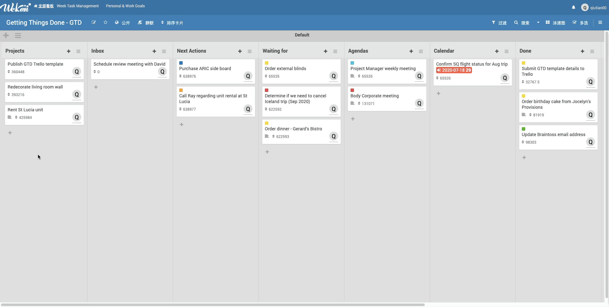
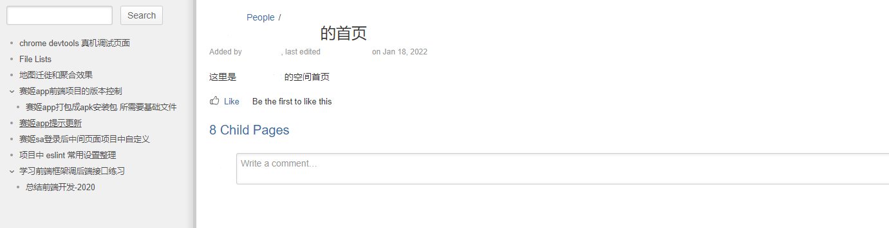
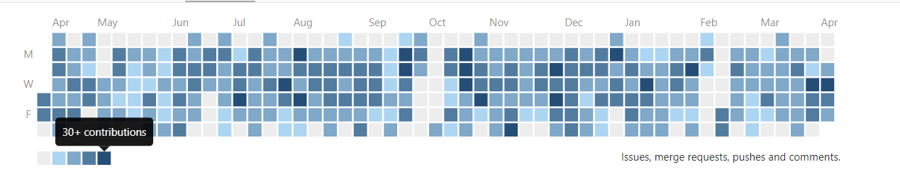

## 李文

**求职意向： web 前端开发 base 广州   期望薪资： 15k，可面议 状态：目前在职**

* _基本信息_:&nbsp;&nbsp;&nbsp;&nbsp;&nbsp;&nbsp;&nbsp;&nbsp;&nbsp;&nbsp;&nbsp;李文 / 1996 / 湖南衡阳 / 全日制本科软件工程专业
* _联系方式_:&nbsp;&nbsp;&nbsp;&nbsp;&nbsp;&nbsp;&nbsp;&nbsp;&nbsp;&nbsp;&nbsp;qiutian.00@qq.com / 15115829405 / [GitHub](https://github.com/qiutian00)
* _工作经验_:&nbsp;&nbsp;&nbsp;&nbsp;&nbsp;&nbsp;&nbsp;&nbsp;&nbsp;&nbsp;&nbsp;5年前端中厂开发经历 / 有带前端实习生经验

<!-- <table>
    <tr>
        <th>基本信息</th>
        <th>照片</th>
    </tr>
    <tr>
        <td>基本信息:&nbsp;&nbsp;&nbsp;&nbsp;&nbsp;&nbsp;&nbsp;&nbsp;&nbsp;&nbsp;&nbsp;李文 / 1996 / 湖南衡阳 / 本科软件工程专业</td>
        <td rowSpan="2"></td>
    <tr>
        <td>联系方式:&nbsp;&nbsp;&nbsp;&nbsp;&nbsp;&nbsp;&nbsp;&nbsp;&nbsp;&nbsp;&nbsp;qiutian.00@qq.com / 15115829405 / GitHub: https://github.com/qiutian00</td>
    </tr>
</table> -->

## 技能 

<!-- * _编程语言_: JavaScript (ES6+) / HTML / CSS -->

* _工具库_: 快速上手react pc, mobile, native等相关框架、组件或开源库, 同时关注前端架构(monorepo 工程)

<!--
  - 脚手架: create react app, vite, umi(dvajs), cordova
  - 数据管理: [easy-peasy](https://github.com/ctrlplusb/easy-peasy), [teafuljs](https://github.com/teafuljs/teaful), [redux saga](https://redux-saga.js.org/)
  - react pc: antd ui, [web map Leaflet](https://leafletjs.com/), material ui, uiw
  - hooks: react hooks, [use-immer](https://github.com/immerjs/use-immer), [react-use](https://github.com/streamich/react-use)
  - react mobile/native: antd mobile, react-vant, react-native-leaflet-view
  - 其他工具: [rollup.js](https://rollupjs.org/), [pnpm workspace](https://pnpm.io/workspaces), [changesets manage version log](https://github.com/changesets/changesets)
  -->

* _工具_: VSCode / IntelliJ IDEA / Git / SVN / Debug (Devtools) / [Linux command](https://wangchujiang.com/linux-command/) / Markdown / Postman / [Fiddler](https://www.telerik.com/fiddler) / [Wekan](https://github.com/wekan/wekan) / [Mock](https://github.com/nuysoft/Mock) / [unit test 使用](https://cnodejs.org/topic/55b9e875f36f579657fc52f3) / 使用arclinux镜像 [vscode 远程开发](https://code.visualstudio.com/docs/devcontainers/containers)

* _框架_: [React](https://reactjs.org/) / [react-native](https://reactnative.cn/docs/getting-started) / 基于tarojs二次封装web组件开发h5应用 / vue3

* _部署_: [Nignx](http://nginx.org/en/) / docker 部署前端 / [Tomcat](http://tomcat.apache.org/)

## 开发的库
- [web-performance-tracer](https://github.com/qiutian00/web-performance-tracer)：🛠️网页性能监控 18 项数据指标，错误收集上报。     
- [user-behaviour-tracer](https://www.npmjs.com/package/user-behaviour-tracer)：🌻 A tiny event emitter library.     
- [event-mitter-js](https://github.com/qiutian00/event-mitter-js)：🌻 A tiny event emitter library.     
- [micro-message](https://github.com/qiutian00/micro-message)：🌸 Micro frontend of data manage.     
- [tabs-bridge](https://github.com/qiutian00/tabs-bridge)：🌿Browser tabs post message.      

## 工作经验

### 1. 广州华资软件有限公司：中级前端开发（2019.11 - 至今）

* 使用微前端技术， 在项目中落地微前端; 开源[微前端通信 npm lib](https://github.com/qiutian00/micro-message)

* 快速高质量开发前端模块（独立拆解思维方式：大模块可以拆为小任务； 理解一个模块交换闭环）， 难点问题能够快速找到前端相关的解决方案
* react 生态中组件可以快速上手使用： [Swiper](https://github.com/nolimits4web/swiper) ， [AntV F2](https://f2.antv.vision/zh/docs/tutorial/getting-started)，富文本组件，移动端组件， react native组件， 自定义hooks
* 地图开发（百度地图开发， 天地图开发， [Leaflet](https://leafletjs.com/) 使用）

* h5 app开发（主要技术栈react ，[UmiJs](https://umijs.org/)，app use [standard-version](https://github.com/conventional-changelog/standard-version) 来发布app， 使用cordova 原生插件来自动下载和更新app
）
* 积极投入开源中(翻译wekan中英文)， 关注前端技术，关注前端项目打包体积减少优化，提升工作效率等
* [日常额外小知识输出](https://www.notion.so/e8f91011b6d0476a9da4fce440ee3940?v=b118ab23d1b345ed8aa86b13d6567b5c)

* 难点技术开发： 大屏使用虚拟列表 / 维护60+个tarojs封装web组件 / pnpm + workspace + changesets 搭建 monorepo 工程

<!--   -->
<!-- * 上线系统快速定位问题并修复 -->
<!-- * 自学 react native -->
<!-- * 总结适应于项目中eslint配置 -->
<!-- * use v2ray to visit google and some post -->
<!-- * 工作日志记录 && 复盘 -->
<!-- * 读书（自卑与超越， 非暴力沟通， 儒林外史，墨菲定律，当下的力量，曾文正公家书，蒋勋细说红楼梦等35本以上） -->
<!-- #### 内部开发记录和提交 -->

<!--   -->
<!--   -->

### 2. 依据数据（湖南）科技有限公司：实习（2017.12 - 2018.05）  前端开发（2018.6 - 2019.08）

* **layui 主打的前端项目**: 包括统一用户授权，数据交换中心和电子健康卡等
    *  layui + jQuery + zTree + treantjs + fetch + Bootstrap + font-awesome
    *  前端80%模块都有参加功能实现，期间独立完成部署文档编写， sql 脚本维护， 打包和开发环境部署
    *  独立学习 treantjs [流程图](https://github.com/qiutian00/resume/blob/master/me/img/treant_demo.png)的使用， 前端实现 excel 导入导出(从 [GitHub](https://github.com/qiutian00) 上发现的 ExcelJS， SheetJS)

* **[数据大屏展示](https://github.com/qiutian00/large-screen-show)**
    * layui + axios + ECharts lib + CountTo + Gulp工具开发 
    * 主导整个项目的搭建，打包和部署
    * 负责页面所有 ECharts 图（含有甘肃省医疗机构地图， 多点汇聚到一点动态显示）实现和样式调整， 实现 ECharts 中多种图形结合使用
  

* **React 实现的小程序管理端系统**
    * Ant Design Pro + momentjs + braft-editor + chartjs + ExcelJS && FileSaver + react-icons
    * 实现基于 Facebook draft-js 的 [braft-editor 富文本编辑器](https://github.com/margox/braft-editor)操作， [chartjs   图](https://github.com/chartjs/Chart.js)在 React 中使用， 图片上传（基于 Ant Design Upload ），并注重于 Git 提交规范，编码规范
    * 熟悉 Debugging in VS Code 和 React Devtool in Chrome

<!-- #### 收获  -->
<!-- - 前后端分离的项目：前端研发需要了解快速调试后端接口或明白接口的报错信息等，快速定位问题，减少沟通成本 -->
<!-- - 避免不好情绪影响工作，在适当的时候，提出问题或者需求帮助 -->
<!-- - 核心功能未有持续性跟踪，新的问题需要重新确定解决方案，也需要研发人员及时反馈  -->
<!-- - 视研发团队情况，需要有统一的代码规范和多种方式代码审查  -->
<!-- - 需要会上和会下的 code review ，更多使得研发成员对项目的认识达成一致  -->

## 教育

湖南人文科技学院， 本科软件工程专业 Java 方向， 2014.09 - 2018.06

## 自我评价

* 热爱前端技术：活跃于 [GitHub](https://github.com/qiutian00) 和 [V2ex 社区](https://www.v2ex.com/)，发现新前端技术，开源项目和问题解决方案（前端脚本错误监控与定位）， watch 好的开源组件， follow 技术达人；收集大牛博客， 学习分享的文章；也搭建过 [Blog](https://qiutian00.github.io/) ， Linux 上部署过代码仓库管理项目 [Gitea](https://github.com/go-gitea/gitea)，[部署效果](https://github.com/qiutian00/resume/blob/master/me/img/gitea.gif)
* 关注前端基础到部署的整套体系，热衷技术分享： [HTTP 协议原理](me/share/HTTP协议原理分享.pdf)； [Git 远程操作详解](me/share/Git远程操作详解-阮一峰.pdf)； [Postman 使用详解](me/share/postman的使用方法详解.pdf)； [Vim 命令详解](me/share/vi_vim命令使用详解.pdf)； [代码审查](me/share/codeReview)； [如何有效报告 bug ](me/share/如何有效地报告Bug.pdf)； 前端脚本错误： [监控上报](https://github.com/joeyguo/blog/issues/13)， [错误定位](https://github.com/joeyguo/blog/issues/14)
* 团队协作配合意识强（及时完成工作任务，功能模块说明清楚，给予回答不能够说不确定或可能，常了解代码规范，如 [Airbnb JavaScript Style](https://github.com/sivan/javascript-style-guide) ），热于协助同事解决小问题，积极参加团建等活动

<!-- Here the [pdf](me/resume/qiutian00_resume_2022.pdf) and [online](https://qiutian00.github.io/resume/). -->
Please contact me by email at qiutian.00@qq.com.
@copyright by qiutian00.
